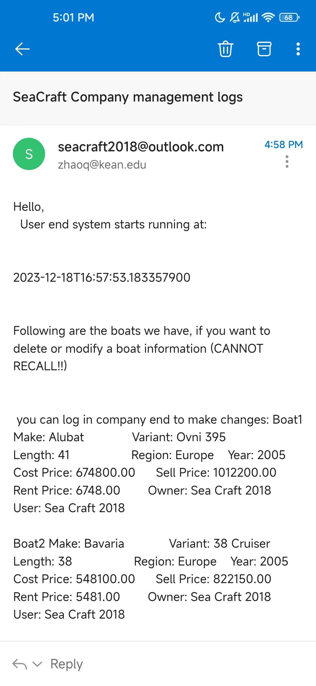
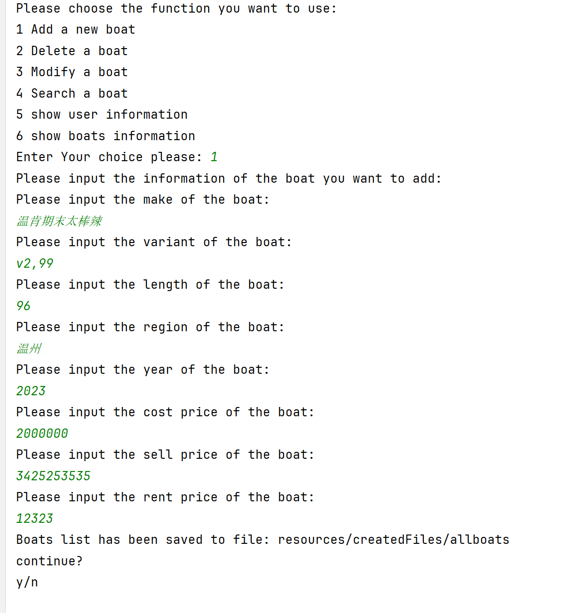
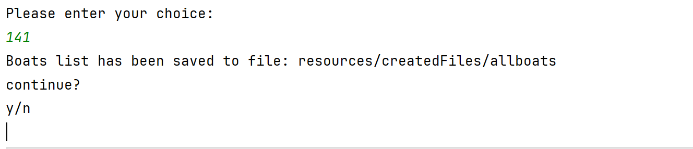
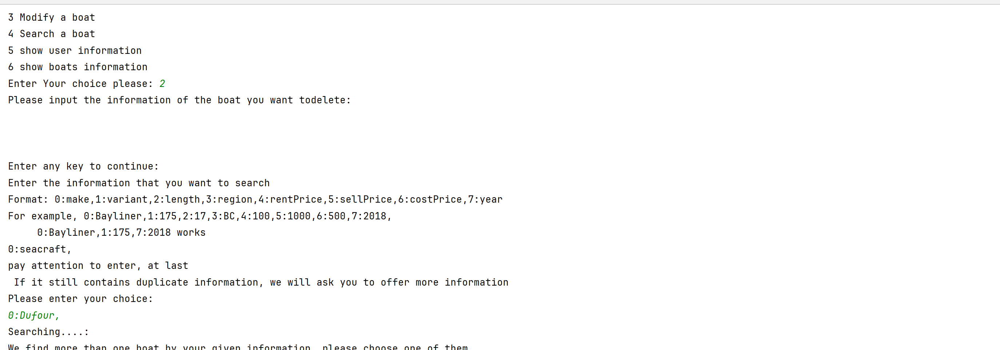
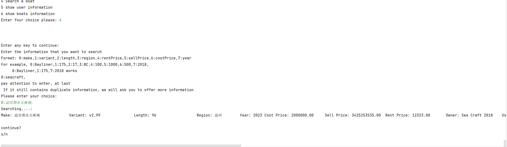

 
<h1 align="center"> CPS 2232 FinalProject: Boat Manager</h1>  

    

Welcome to our project !  This is the `final project` for `CPS 2232`, `Abstract Data Type`, of [`Wenzhou-Kean University`][wku].       
       
**The authors:**   
[***Zhang Lei 1235752***][ZL]   
[***Jiao Luyao 1235723***][JY]   
[***Zhao Qinjian 1235624***][ZJ]
    

# Code framework    
The entire program comprises four major systems: 1. Boat Reading System, 2. Filtering System, 3. Menu System, and 4. Waiting List. Around these systems, various auxiliary functions are implemented as well. We will present all the details in the order of their implementation:    

    

1. Boat Data Source: Boat data is stored in a CSV table, with each row representing a boat and each column representing a specific attribute. Above is a snippet example of a dataset sourced from the 2022 MCM competition problem, containing over 3000 boats, making it a substantial dataset. In real-life scenarios, employees of the company would collect and input boat information into this table.
2. Boat Class: A new class, `Boat`, is abstracted based on common attributes shared by boats. Data fields include characteristic properties of boats, along with owner, user, and waiting list.
3. Reading and Recording Boat Information: An `ArrayList<Boat>` is established to store all boat data. Using a `FileReader`, data is read line by line from the CSV file. For each line read, a new `Boat` object is created and added to the ArrayList. After reading all
information, the details of each object in the ArrayList are retrieved from the stack using the `saveBoatsToFile` method. This information is then stored in a "boats" file, allowing data circulation between different classes. 4. Data Sorting: For numerical attributes (length, sellPrice, rentPrice, year), multiple `TreeMap` sorters are created, and their results are stored in a new `TreeMap`.
5. Data Filtering: For character attributes (make, variant, etc.), multiple filters are created using Java's built-in `computeIfAbsent` function. Results are stored in a new `ArrayList`. For numerical attributes, the TreeMap sorting results are used to limit values within specified upper and lower bounds for filtering.
6. Client Class: Data fields include username, password, email, using boat and owning boat.
7. User Registration System: This system accepts user input for username, password, and email, storing the user's information in a `HashMap` where the key is the username, and the value is a `Client` object. If a duplicate username is detected, the user is prompted to input a new username.
8. User Menu and Exception Handling: The `Menu.java` file is designed for user interaction. It facilitates user registration and login, rejecting access if the username does not exist or the password is incorrect. In the logged-in state, it employs multiple `while` loops and a `switch` function to call filtering methods for corresponding attributes in the `Database` class based on case numbers. Invalid inputs trigger error messages, prompting users to re-enter information. It then calls relevant functions to assist users with payment, boat return, and other operations.
9. Operating system of company's terminal: add, delete, modify and check the ships in the warehouse, and company terminal can also manage and view user information.
10. Email notification: When a user logs into the system, the company's mailbox can receive emails. When the log reaches 20 entries, the company mailbox will receive logs from all users. This can display the company's current transaction records with all users without generating too many emails. When users log in to the system and the transaction is successful, they can also receive email reminders. Users can also receive email reminders when log reach 20. 11. User transaction and log: User can search boats the company have by searching main characteristic such as make, variant, year and length. After searching a boat, user can determine buy, return or borrow boat. After buy transaction, boat can be stored in client’s field ArrayList<Boat>, and the boat will change the user from company to client. One thing should be notice is that the data structure storage boat will note remove the choosing boat, we just set user and owner to get to know whether client can choose this boat. This step can let company manage boats efficiently.
# some challenge about data structure we met    
### 1. Efficient Boat Storage:    
- Challenge: Handling a large number of boats posed a significant challenge in designing an efficient data structure. Balancing storage efficiency with fast retrieval speed was crucial.    
- Solution: Initially, we considered using a double map structure with HashMaps of HashMaps to store boat information. The outer map's key was the boat name, and its value was an inner map. However, this structure faced challenges in data transfer between classes and conversion into ordered data for user filtering. After a team discussion, we opted for an `ArrayList` with objects representing each boat. We successfully transferred data between classes by exporting information from the memory stack to a file.    
### 2. Boat Lookup Optimization:    
- Challenge: Switching to an `ArrayList` introduced concerns about the reduced speed oftraversal and lookup operations.    
- Solution: In the `Database` file, we pre-created several sorters commonly used by clients and stored their results in a new `TreeMap`. During filtering, these pre-sorted data were automatically accessed, significantly speeding up the lookup process. Additionally, we used the `computeIfAbsent` function to create various filtering methods, extracting objects meeting specific conditions from the input `ArrayList` and storing them in a new `ArrayList`. This function accelerated the filtering process. Notably, we transformed boolean filtering using extensive research to leverage the `computeIfAbsent` function.    
### 3. User Recommendation System Design:    
- Challenge: The extensive options available to users resulted in a complex menu system, leading to code clutter.    
- Solution: We stacked multiple `while` loops, `switch` functions, and other control structures for boat filtering and the recommendation system. However, this resulted in confusion regarding the use of the `Scanner`. Then we find use `Scanner`as parameter can settle. Further research is needed to refine the design and resolve this issue.    
### 4. Details for lambda expression:    
- When we use foreach, we find that lambda is not suitable for implementing variable traversal. - Solution: After consulting the information, we found that when using Lambda expressions and forEach loops, if you try to modify externally defined variables inside the Lambda expression, a compilation error will occur. This is because the variables referenced inside the lambda expression must be final or effectively final. After searching, we know that we can use a java custom method AtomicInteger to solve this problem.    

## How to deploy our project

       git clone https://github.com/Lareina2441/CPS2232_FinalProject.git  
Open this project in your local IDE (the following is an example using IDEA).
Find `project structure`  then click dependencies. Add the jars file in [resources](./resources)

                   

CHANGE EMAIL INFORMATION IN [COMPANY.JAVA](./src/backend/CompanyEmailSender.java) and [COMANY.JAVA](./src/person/Company.java)  

## 1. Run the [BoatCreater](./src/boat/BoatCreator.java) class first, when the binary code generated successfully, run the [Menu](./src/backend/Menu.java)

 (the boats has been created, we got 2346 boats in total)
  

## 2. Run the main method in [Menu](./src/backend/Menu.java)
   class, then you can run the project as administrator or client.  

 (when someone is using the system, the email will be sent to the administrator's email.
)

## 3. enter the system you want (client or administrator), then you can use the system.
### Company System :
**SEAERCH** : you can **SEARCH** by function 5 and 6.
**you can search boat information by our filter:**  
 **you can see the user information, THE PASSWORD IS HIDDEN**
**Following are boats informaiton**
 **you can add a boat**
 **you can delete a boat by searching the boat info by filter**

**you can search detailed information of a boat by our filter**
 **you can modify a boat** 

### Client System :
**REGISTER** : you can register a new account in the system.  

  

Use data from csv to create object "boat". put all boats in ArrayList and give their index.   

  

use objectOutputStream, write object "ArrayList" in file.
emphasize: the reason we use ArrayList
1. traverse/ access by index
2. low efficiency in "add" or "remove". but we avoid it.

### register()
 

we also save clients' info in File and offer method to load it.  

  

when client register their count, new entry <String, Client> will be put in Map.  
Map: without duplicate so without same user name(!containsKey(key)), just O(1) to find specific Client.  
 
### login()
 

when login successfully, "fiveRequest(name)"will be invoked to let client do following operation. In this step, "name" be a parameter passed in following method.  

  
 
#### 1. borrow and buy
 

all use method recommandBoat to return the boat the client want to operate.  
  
 

Client may not know which boat to choose, we will use subMap to recommand boat by price.  
After client know which boat to buy/borrow, transaction start.  

  

buyTransaction is same as borrowTransaction in aspect of judge the boat is busy or not. but a little differnet:  

  
 
#### 2. return
 

we not expect that client will return the boat which is sold out, so we just check use() list.    
  

   

[ZL]: https://github.com/Lareina2441
[JY]: https://github.com/GemmaJiao
[ZJ]: https://github.com/AlbertZhaoCA
[wku]: https://www.wku.edu.cn/en/
[DC]: ./src/backend/Datastructure.java
[BC]: ./src/boat/Boat.java
