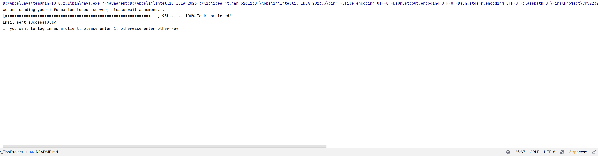
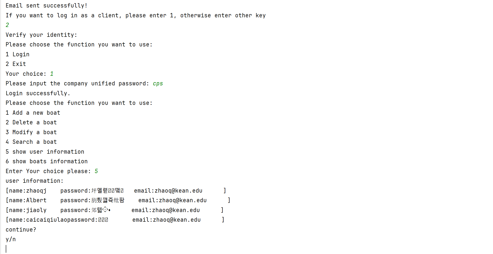
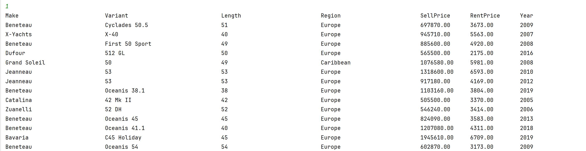
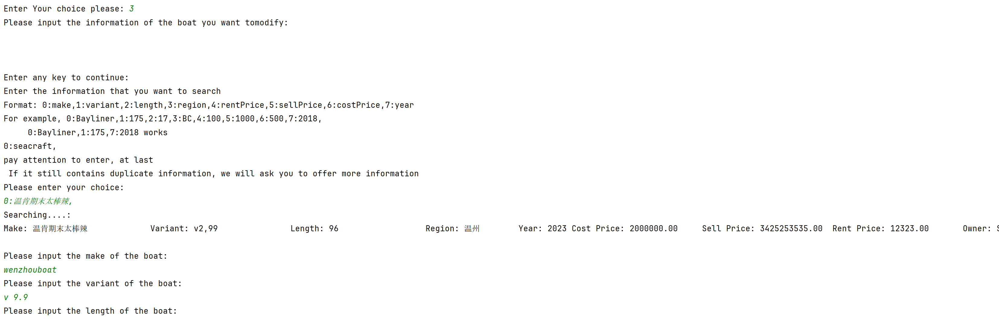
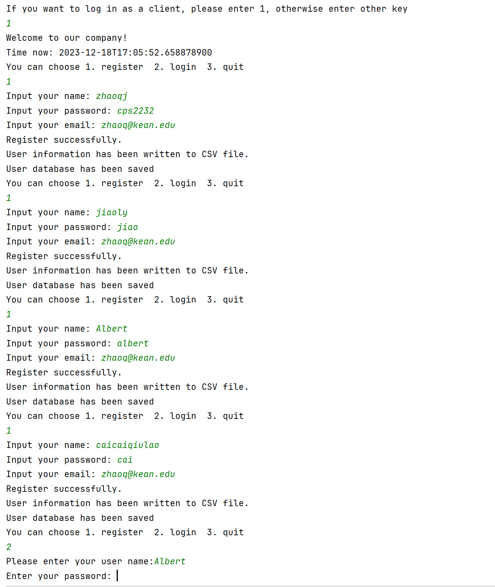

<h1 align="center"> CPS 2232 FinalProject: Boat Manager</h1>  

  

Welcome to our project !  This is the `final project` for `CPS 2232`, `Abstract Data Type`, of [`Wenzhou-Kean University`][wku].       
       
**The authors:**   
[***Zhang Lei***][ZL]   
[***Jiao Luyao***][JY]   
[***Zhao Qinjian***][ZJ]

## How to deploy our project

       git clone https://github.com/Lareina2441/CPS2232_FinalProject.git  
Open this project in your local IDE (the following is an example using IDEA).
Find `project structure`  then click dependencies. Add the jars file in [resources](./resources)

1. Run the [BoatCreater](./src/boat/BoatCreator.java) class first, when the binary code generated successfully, run the [Menu](./src/backend/Menu.java)

 (the boats has been created, we got 2346 boats in total)
  

2. Run the main method in [Menu](./src/backend/Menu.java)
   class, then you can run the project as administrator or client.  

 (when someone is using the system, the email will be sent to the administrator's email.
)

3. enter the system you want (client or administrator), then you can use the system.
## Company System :
**SEAERCH** : you can **SEARCH** by function 5 and 6.
**you can search boat information by our filter:**  
 **you can see the user information, THE PASSWORD IS HIDDEN**
**Following are boats informaiton**
 **you can add a boat**
 **you can delete a boat by searching the boat info by filter**

**you can search detailed information of a boat by our filter**
 **you can modify a boat** 

## Client System :
**REGISTER** : you can register a new account in the system.

  

[ZL]: https://github.com/Lareina2441
[JY]: https://github.com/GemmaJiao
[ZJ]: https://github.com/AlbertZhaoCA
[wku]: https://www.wku.edu.cn/en/
[DC]: ./src/backend/Datastructure.java
[BC]: ./src/boat/Boat.java
